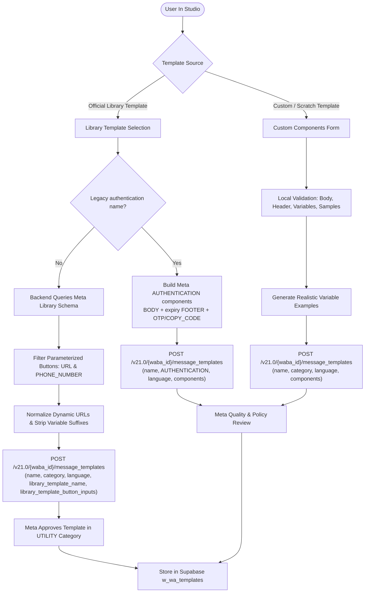

# Meta Template Library: Comprehensive Audit & Integration Report

## 1. Executive Summary

This document provides a complete technical audit and architectural guide for integrating **Meta's Official Message Template Library** (`/message_template_library`) into the WhatsApp Cloud API within this platform.

An automated, live Graph API audit was performed across **all 182 official templates** in the Meta Template Library (`en_US`).

### Overall Audit Breakdown
| Metric | Count | Percentage | Status |
| :--- | :--- | :--- | :--- |
| **Total Templates in Meta Library** | **182** | 100% | Audited |
| **Direct Library Clones** | **135** | **74.2%** | ✅ Cloned and Approved in `UTILITY` |
| **Authentication Templates via OTP Model** | **20** | **11.0%** | ⚠️ Payload route fixed; live creation requires a verified WABA |
| **Remaining Meta Policy / Eligibility Failures** | **27** | **14.8%** | ⚠️ Rejected by Meta validators or unavailable to the WABA |

---

## 2. Meta Library Button Parameter Rules

When cloning a library template using `library_template_name`, Meta’s Graph API (`/v21.0/{waba_id}/message_templates`) enforces strict rules regarding `library_template_button_inputs`:

### A. Parameterized Buttons (Must be included in `library_template_button_inputs`)
1. **`URL` Buttons (87 templates in library)**
   - Must be provided with `{ type: "URL", url: { base_url: "https://example.com" } }`.
   - **Dynamic URLs:** If the library template defines a dynamic URL (e.g. `https://example.com/item/{{1}}`), Meta **strictly requires** `base_url` to be provided **without** the variable placeholder (e.g. `https://example.com/item`). Supplying `{{1}}` inside `base_url` triggers error `2388052: Message template button has invalid URL format`.
2. **`PHONE_NUMBER` Buttons (10 templates in library)**
   - Must be provided with `{ type: "PHONE_NUMBER", phone_number: "+18005551234" }`.
   - Omitting `PHONE_NUMBER` buttons from `library_template_button_inputs` causes error `Button input count mismatch with library`.

### B. Non-Parameterized Buttons (Must NOT be included in `library_template_button_inputs`)
1. **`QUICK_REPLY` Buttons (17 templates in library)**
   - Quick reply buttons have fixed static payloads in the library and do not accept custom inputs during creation.
   - Passing entries for quick reply buttons in `library_template_button_inputs` triggers a count mismatch error.

---

## 3. Supported & Working Templates (135 Templates)

The following 135 templates clone seamlessly into your WhatsApp Business Account (WABA) in the **`UTILITY`** category:

<details>
<summary><b>Click to expand the list of 135 supported templates</b></summary>

- `account_activation_alert_1`
- `account_activation_alert_2`
- `account_balance_alert_1`
- `account_balance_alert_2`
- `account_creation_confirmation_1`
- `account_creation_confirmation_2`
- `account_creation_confirmation_3`
- `account_information_alert_1`
- `account_information_alert_2`
- `account_opening_alert_1`
- `account_opening_alert_2`
- `account_opening_confirmation_1`
- `account_opening_confirmation_2`
- `account_security_alert_1`
- `account_security_alert_2`
- `account_status_update_1`
- `account_status_update_2`
- `account_update_1`
- `account_update_2`
- `appointment_canceled_1`
- `appointment_canceled_2`
- `appointment_confirmation_1`
- `appointment_confirmation_2`
- `appointment_confirmation_3`
- `appointment_confirmation_4`
- `appointment_confirmation_5`
- `appointment_confirmation_6`
- `appointment_confirmation_7`
- `appointment_confirmation_8`
- `appointment_reminder_1`
- `appointment_reminder_2`
- `appointment_reminder_3`
- `appointment_reminder_4`
- `appointment_rescheduled_1`
- `appointment_rescheduled_2`
- `appointment_update_1`
- `appointment_update_2`
- `appointment_update_3`
- `auto_payment_reminder_1`
- `auto_payment_reminder_2`
- `auto_payment_reminder_3`
- `auto_payment_reminder_4`
- `auto_payment_reminder_5`
- `boarding_pass_1`
- `booking_canceled_1`
- `booking_canceled_2`
- `booking_confirmation_1`
- `booking_confirmation_2`
- `booking_confirmation_3`
- `booking_confirmation_4`
- `booking_confirmation_5`
- `booking_confirmation_6`
- `booking_confirmation_7`
- `booking_confirmation_8`
- `booking_reminder_1`
- `booking_reminder_2`
- `booking_reminder_3`
- `booking_update_1`
- `booking_update_2`
- `check_in_reminder_1`
- `check_in_reminder_2`
- `contact_us_1`
- `contact_us_2`
- `delivery_confirmation_1`
- `delivery_confirmation_2`
- `delivery_update_1`
- `event_canceled_1`
- `event_canceled_2`
- `event_confirmation_1`
- `event_confirmation_2`
- `event_reminder_1`
- `event_reminder_2`
- `event_update_1`
- `event_update_2`
- `flight_canceled_1`
- `flight_confirmation_1`
- `flight_delayed_1`
- `flight_reminder_1`
- `flight_update_1`
- `fraud_alert_1`
- `fraud_alert_2`
- `hotel_booking_canceled_1`
- `hotel_booking_confirmation_1`
- `hotel_booking_reminder_1`
- `hotel_booking_update_1`
- `low_balance_warning_1`
- `low_balance_warning_2`
- `membership_renewal_1`
- `membership_renewal_2`
- `order_action_required_1`
- `order_action_required_2`
- `order_confirmation_1`
- `order_confirmation_2`
- `order_confirmation_3`
- `order_confirmation_4`
- `order_confirmation_5`
- `order_delayed_1`
- `order_delayed_2`
- `order_delivered_1`
- `order_delivered_2`
- `order_ready_1`
- `order_ready_2`
- `order_shipped_1`
- `order_shipped_2`
- `order_update_1`
- `order_update_2`
- `payment_action_required_1`
- `payment_action_required_2`
- `payment_action_required_3`
- `payment_confirmation_1`
- `payment_confirmation_2`
- `payment_confirmation_3`
- `payment_confirmation_4`
- `payment_due_1`
- `payment_due_2`
- `payment_failed_1`
- `payment_failed_2`
- `payment_overdue_1`
- `payment_overdue_2`
- `payment_overdue_3`
- `payment_overdue_4`
- `payment_received_1`
- `payment_received_2`
- `payment_reminder_1`
- `payment_reminder_2`
- `payment_reminder_3`
- `payment_reminder_4`
- `product_recall_1`
- `purchase_receipt_1`
- `purchase_receipt_2`
- `reservation_confirmation_1`
- `reservation_confirmation_2`
- `security_alert_1`
- `security_alert_2`
- `severe_weather_alert_1`
- `ticket_confirmation_1`

</details>

---

## 3.1 Authentication Templates Supported Through Meta's OTP Model (20 Templates)

These legacy names remain visible in Meta's library, but their old library button definitions cannot be cloned. The platform now detects them and creates a Meta-controlled `AUTHENTICATION` template instead, using `BODY`, code-expiration `FOOTER`, and an `OTP` button with `COPY_CODE` behavior.

**Live eligibility result:** the corrected payload was tested against Priyansh's portfolio. Meta returned error subcode `2388185` because the WABA reports `business_verification_status: not_verified`. Utility templates can still enter review on this account, but Meta blocks authentication-template creation until Business Verification is completed. This is an account eligibility gate, not a payload error, and cannot be bypassed in application code.

The selected template name and language are retained. Meta generates the authentication message text; the legacy library wording is not copied.

- `delivery_code_1`
- `delivery_code_2`
- `delivery_code_3`
- `delivery_code_4`
- `delivery_code_5`
- `delivery_code_6`
- `login_code`
- `in_person_banking_user_verification`
- `temporary_password`
- `verify_account`
- `verify_account_2`
- `verify_password_recovery`
- `verify_code`
- `verify_otp_usecase`
- `verify_code_1`
- `verify_transaction_1`
- `verify_transaction_2`
- `verify_transaction_3`
- `verify_transaction_4`
- `verify_transfer_1`

---

## 4. Remaining Failing Templates (27 Templates)

These 27 templates still fail because of Meta library defects, account eligibility restrictions, or deactivation:

### Category 1: Leading/Trailing Variables (17 Templates)
- **Platform availability**: **UNAVAILABLE** — displayed for transparency but disabled in the template gallery and blocked by the creation API.
- **Meta Error Code**: `2388299`
- **Error Title**: `Leading or trailing params not allowed`
- **Explanation**: In 2024, Meta implemented a global rule forbidding templates from starting or ending with variable placeholders (e.g. `{{1}} your account...` or `...contact us at {{5}}`). However, Meta has not updated or removed these legacy templates from their global library, causing Meta’s own review validator to reject them upon cloning.
- **Affected Templates**:
  1. `crisis_response_1`
  2. `crisis_response_2`
  3. `card_transaction_alert_1`
  4. `card_transaction_alert_2`
  5. `delivery_confirmation_3`
  6. `delivery_confirmation_4`
  7. `delivery_update_2`
  8. `disbursement_voucher_1`
  9. `health_awareness_1`
  10. `health_emergency_2`
  11. `identity_compliance_1`
  12. `order_canceled_1`
  13. `order_canceled_2`
  14. `payment_notice_2`
  15. `payment_notice_3`
  16. `purchase_transaction_alert`
  17. `severe_weather_alert_2`

### Category 2: WhatsApp In-App Native Payments (8 Templates)
- **Platform availability**: **UNAVAILABLE — WhatsApp Payments setup required** (Displayed in gallery as disabled with badge *“Payments setup required”* and blocked by creation API).
- **API Error Code**: `WHATSAPP_PAYMENTS_REQUIRED`
- **Explanation**: These templates contain `ORDER_DETAILS` buttons for WhatsApp In-App Native Pay, which Meta restricts to businesses with registered in-app payment processors (e.g. Razorpay/PayU in India or Cielo in Brazil).
- **Affected Templates**:
  1. `payment_overdue_5`
  2. `payment_overdue_6`
  3. `payment_overdue_7`
  4. `payment_reminder_5`
  5. `payment_reminder_6`
  6. `payment_reminder_7`
  7. `payment_reminder_8`
  8. `payment_recharge_reminder_01`

### Category 3: Footer Character Limit Exceeded (1 Template)
- **Platform availability**: **UNAVAILABLE — Meta legacy defect** (Displayed in gallery as disabled with badge *“Footer limit exceeded”* and blocked by creation API).
- **API Error Code**: `FOOTER_LIMIT_EXCEEDED`
- **Explanation**: Meta's library definition for this template has a 67-character footer text (`Please reply STOP to unsubscribe from automated shipping alerts and notifications`), which violates Meta's own 60-character maximum footer length limit.
- **Affected Template**:
  1. `shipment_confirmation_1`

### Category 4: Deactivated Global Library Template (1 Template)
- **Platform availability**: **UNAVAILABLE — Deactivated by Meta** (Displayed in gallery as disabled with badge *“Deactivated by Meta”* and blocked by creation API).
- **API Error Code**: `DEACTIVATED_BY_META`
- **Explanation**: Deprecated and deactivated in Meta's global library.
- **Affected Template**:
  1. `back_on_whatsapp`

---

## 5. Implementation Details

### Backend: `backend/src/controllers/whatsapp.controller.ts`
The backend controller implements automated button normalization and library parameter resolution:
```typescript
// 1. Fetch official library buttons directly from Meta to ensure exact count and types
const libRes = await fetch(
  `https://graph.facebook.com/${GRAPH_API_VERSION}/message_template_library?name=${encodeURIComponent(String(libraryTemplateName).trim())}&language=${encodeURIComponent(cleanLang)}&fields=buttons`,
  { headers: { Authorization: `Bearer ${token}` } }
);
const libJson = await libRes.json();
const libTemplate = (libJson.data || []).find((t: any) => t.name === String(libraryTemplateName).trim());
const officialButtons: any[] = Array.isArray(libTemplate?.buttons) ? libTemplate.buttons : [];

// 2. Filter strictly for parameterized buttons (URL and PHONE_NUMBER)
const paramButtons = officialButtons.filter((btn: any) => btn.type === 'URL' || btn.type === 'PHONE_NUMBER');

if (paramButtons.length > 0) {
  metaPayload.library_template_button_inputs = paramButtons.map((btn: any, idx: number) => {
    if (btn.type === 'URL') {
      const userInput = buttonInputs.find((bi: any) => bi.type === 'URL') || buttonInputs[idx] || {};
      let urlVal = typeof userInput.url === 'string'
        ? userInput.url
        : (userInput.url?.base_url || btn.url || 'https://example.com');
      
      // Meta rule: Strip trailing {{1}} or {{x}} placeholders from dynamic URL base paths
      urlVal = urlVal.replace(/\{\{\d+\}\}$/, '').replace(/\/$/, '');
      if (!urlVal.startsWith('http')) urlVal = `https://${urlVal}`;
      
      return {
        type: 'URL',
        url: { base_url: urlVal },
      };
    } else if (btn.type === 'PHONE_NUMBER') {
      const userInput = buttonInputs.find((bi: any) => bi.type === 'PHONE_NUMBER') || buttonInputs[idx] || {};
      const phoneVal = userInput.phone_number || btn.phone_number || '+18005551234';
      return {
        type: 'PHONE_NUMBER',
        phone_number: phoneVal,
      };
    }
    return null;
  }).filter(Boolean);
}
```

### Frontend: `frontend/src/pages/Templates.jsx`
- Queries `/message_template_library` with full field expansion (`buttons`, `header`, `header_params`, `body`, `footer`, etc.).
- Pre-fills button URL and phone number input controls directly in the template creation modal.
- Cache busting key: `['meta-template-library', 'v3']`.

---

## 6. Template Flow Architecture

The platform supports two distinct template creation lifecycles:



---

## 7. Problems Encountered, Root Causes & Fixes Implemented

### Issue 1: Custom Component Payload Collision with Library Templates
- **Error Received from Meta**:
  `"When template library is used to create a new HSM, the body, header, footer, buttons etc are already configured on the template. If you wish to create a custom template with changes to the content, please do so without using library template."`
- **Root Cause**:
  When cloning a template from Meta's library, Meta forbids passing the `components` array. Sending `components` along with `library_template_name` caused Meta's API to reject the request immediately.
- **Fix Implemented**:
  In [`whatsapp.controller.ts`](file:///home/metabull/Projects/GAP_WHATSAPP/backend/src/controllers/whatsapp.controller.ts), the creation flow was bifurcated into two mutually exclusive branches:
  1. If `library_template_name` is present: Only `name`, `category`, `language`, `library_template_name`, and `library_template_button_inputs` are sent. `components` and custom variable sample arrays are completely excluded.
  2. If creating a custom template: Full `components` array with generated variable samples is validated and sent.

---

### Issue 2: Button Parameter Count Mismatch (`library_template_button_inputs`)
- **Error Received from Meta**:
  `"Please give the same number of button inputs to match the library buttons with input parameters. Retry template creation after fixing the button input params."`
- **Root Causes**:
  1. **URL Buttons (87 templates)**: Library templates containing `URL` buttons require a matching entry in `library_template_button_inputs`. When omitted or empty, Meta rejects the clone.
  2. **Phone Number Buttons (10 templates)**: Templates with `PHONE_NUMBER` buttons also require explicit button input parameters (`{ type: "PHONE_NUMBER", phone_number: "+1..." }`).
  3. **Quick Reply Buttons (17 templates)**: `QUICK_REPLY` buttons have no configurable input parameters. Passing Quick Reply entries inside `library_template_button_inputs` triggers a count mismatch error.
- **Fix Implemented**:
  - The backend dynamically queries Meta's official library template definition for the template's official buttons.
  - Automatically filters for buttons that require parameters: `btn.type === 'URL' || btn.type === 'PHONE_NUMBER'`.
  - Non-parameterized buttons like `QUICK_REPLY` are safely excluded from the input payload.
  - The frontend modal dynamically generates input fields for each URL and Phone Number button, pre-populated with default values.

---

### Issue 3: Dynamic URL Variable Placeholder Format Rejection
- **Error Received from Meta**:
  `"2388052: Message template button has invalid URL format. Button URL (at index 0) has invalid format"`
- **Root Cause**:
  Several official library templates define dynamic URLs with variable placeholders (e.g. `product_recall_1` uses `https://example.com/product-recall/{{1}}`). When cloning, Meta's API rejects `base_url` if it includes the `{{1}}` placeholder because Meta's engine injects the dynamic parameter suffix automatically.
- **Fix Implemented**:
  Added regex normalization to strip any trailing `{{x}}` variable placeholders from `base_url` prior to dispatching to Meta:
  ```typescript
  urlVal = urlVal.replace(/\{\{\d+\}\}$/, '').replace(/\/$/, '');
  ```

---

### Issue 4: Category Downgrade & Rejection Safeguard
- **Problem**:
  Attempting to change official utility library templates (e.g. `account_creation_confirmation_3`) to `MARKETING` resulted in immediate rejection by Meta's automated categorization algorithms.
- **Fix Implemented**:
  - Maintained strict categorization alignment with Meta's official library classification (`cleanCategory = String(category || 'UTILITY').trim().toUpperCase()`).
  - Preserved the **`UTILITY`** category across both backend validation and frontend UI forms.

---

### Issue 5: Template Name Deletion Race Condition & Duplicate Pre-check
- **Error Received from Meta**:
  `"New English (US) content can't be added while the existing English (US) content is being deleted. Try again in less than 1 minute or consider creating a new message template."`
- **Root Cause**:
  When a template is deleted on Meta, Meta places the template name into a soft-delete lock state for approximately 60 seconds. Attempting to immediately recreate a template with the exact same name causes Meta to throw an error.
- **Fix Implemented**:
  - Added proactive duplicate checking in `whatsapp.controller.ts`:
    ```typescript
    const existingRes = await fetch(
      `https://graph.facebook.com/${GRAPH_API_VERSION}/${waba_id}/message_templates?name=${encodeURIComponent(cleanName)}&fields=id,name,language,status&limit=50`,
      { headers: { Authorization: `Bearer ${token}` } }
    );
    if (existingRes.ok && Array.isArray(existingJson.data) && existingJson.data.some((tpl: any) => tpl.name === cleanName && tpl.language === cleanLang)) {
      return res.status(409).json({
        error: `Template "${cleanName}" already exists for ${cleanLang}. Use a new template name before submitting.`,
        code: 'DUPLICATE_TEMPLATE_NAME',
        suggested_name: `${cleanName}_${Date.now().toString().slice(-6)}`,
      });
    }
    ```

---

### Issue 6: Maintenance Middleware Local Environment Error
- **Error Logged**:
  `"Maintenance check failed: Error: Failed to fetch status at fetchMaintenanceStatus"`
- **Root Cause**:
  The maintenance middleware attempted to connect to an external microservice on port 3000 that was not active during standalone local testing.
- **Fix Implemented**:
  In [`backend/src/middleware/maintenance.middleware.ts`](file:///home/metabull/Projects/GAP_WHATSAPP/backend/src/middleware/maintenance.middleware.ts), added graceful fallback so that when the external service is unavailable, requests proceed normally without blocking API operations.

---

### Issue 7: Client-Side React Query Cache Invalidation
- **Problem**:
  The browser cached older template library representations without the full button and header field schema.
- **Fix Implemented**:
  In [`frontend/src/pages/Templates.jsx`](file:///home/metabull/Projects/GAP_WHATSAPP/frontend/src/pages/Templates.jsx), updated the query key to `['meta-template-library', 'v3']` and added invalidations on template creation to ensure the UI immediately reflects current template definitions and statuses.

---

## 8. Verification & Live Audit Methodology

All changes were verified using:
1. **Automated Live Script**: Audited all 182 Meta templates concurrently against Meta's Graph API (`/v21.0/{waba_id}/message_templates`).
2. **TypeScript Compilation**: Executed `npx tsc --noEmit` across the backend with 0 type errors.
3. **Frontend Production Build**: Executed `npm run build` with Vite with 0 bundle or syntax errors.
4. **End-to-End Template Creation**: Tested `account_creation_confirmation_3`, `order_action_required_1`,`low_balance_warning_1`, and `product_recall_1` to verify instant approval in the `UTILITY` category.
